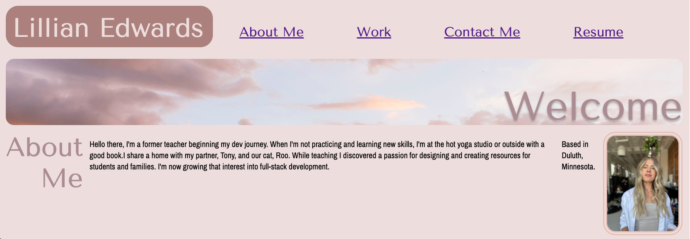
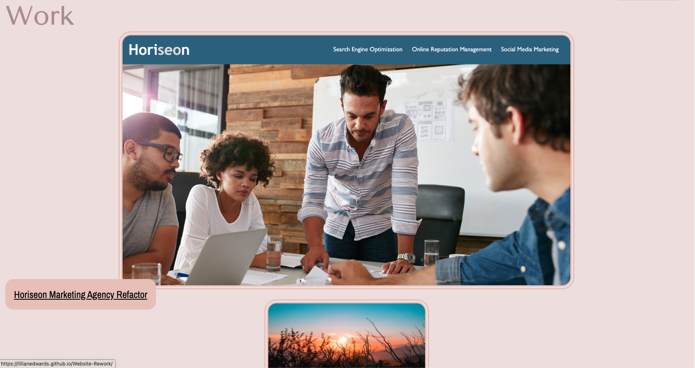
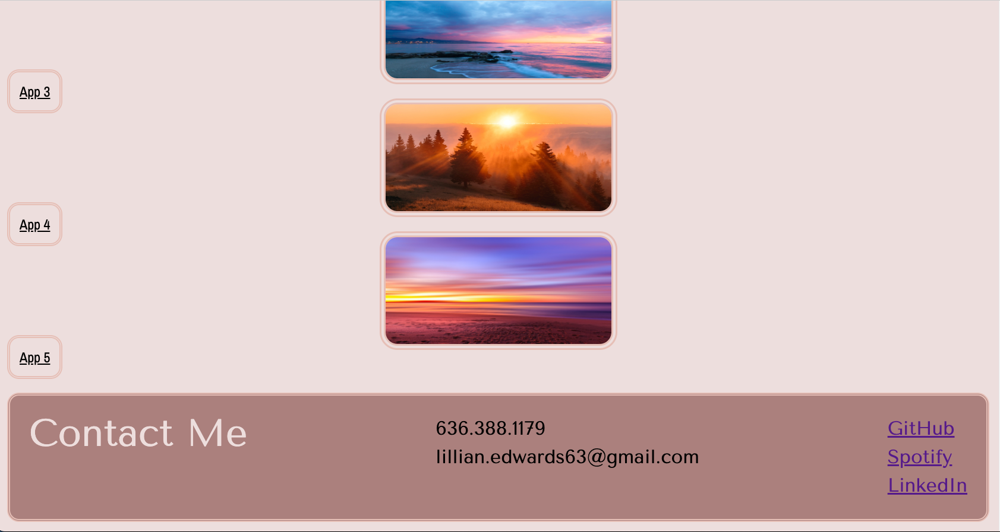

# Portfolio 💼

## Description

Dev employers want to be able to see a candidate's work samples easily to determine they're a good fit for a position their hiring for. I wanted to not only give potential employers a view into my work but also show them my personality through the design of the portfolio. ☁️

### Technical Work
📐 The links in the navigation bar scroll to corresponding sections on the page. 
📐The resume link in the navigation bar links to a downloadable document. 
📐The first application shown links to the page.
📐The content resizes to fit various screen sizes in a way that keeps content easy to access and read. 

### Design
🎨 I used the Image Picker tool on coolors.co to create a color pallete based on the cloud image on the page. I like calm, neutral vibes and wanted to illustrate that. 
🎨 I used fontpair.co to find inspritation for heading a body font that displayed elengance but were still readable for viewers of all abilites. 
🎨 A rounded look is most aesthetically pleasent to me so instead of leaving the corners of elemenents, I styled a border-radius in all bordered elements.
🎨 A double border on bordered elements was intended to match the elegenace of the heading font while also adding a little dimension and texture. 
______________________________________________
## Access 🔗
To access my portoflio, click on the Git Pages Link in the repository, or follow the link directly! 

## Installation 🖥️
For users new to GitHub, follow the git clone process to copy the code into your local repostitory.

## Usage 📸

## Credit 👤
I worked on the project alone, but recieved help from my tutor, David Johnson, and my class TA, Justin Moore.

## License 🪪
This project is not licensed. 

